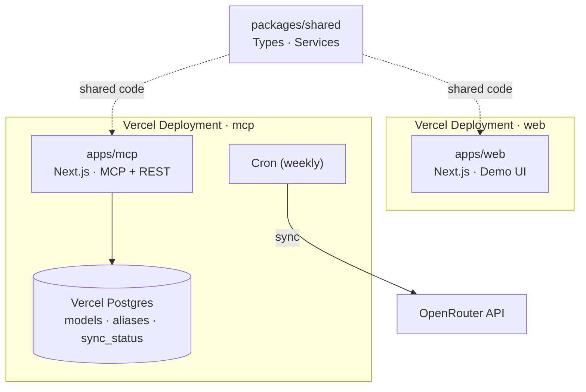

# OpenRouter MCP Registry

[](https://vercel.com/new/clone?repository-url=https://github.com/tj60647/openrouter-mcp-registry)

A production-ready monorepo that provides a **centralized MCP model registry** backed by OpenRouter, plus a **demo web application**. Designed for zero-config deployment on Vercel.

## Why?

AI coding assistants and agents that call LLM APIs directly suffer from:
- **Stale model names** — providers rename, deprecate, or remove models without notice
- **No abstraction** — every client hardcodes its own model IDs
- **No catalog** — no single source of truth for what models exist and what they cost

This registry solves all three problems:
- Fetches the live model catalog from OpenRouter weekly (and on-demand)
- Exposes a stable alias layer (`sonnet`, `fast-general`, `auto`, …)
- Serves an MCP-compatible endpoint that AI clients can query

---

## Architecture



### Monorepo layout

```
openrouter-mcp-registry/
├── apps/
│   ├── mcp/          Next.js app — MCP server + REST API
│   └── web/          Next.js app — Demo UI + REST API
├── packages/
│   └── shared/       Shared TypeScript — types, services, providers
├── vercel.json       Vercel cron + function config
├── .env.example      All environment variables documented
└── pnpm-workspace.yaml
```

---

## REST API

| Method | Path | Description |
|--------|------|-------------|
| `GET` | `/api/models` | List cached models (`?limit`, `?offset`, `?provider`) |
| `GET` | `/api/models/:id` | Get model by canonical ID |
| `POST` | `/api/resolve` | Resolve alias/ID → canonical model |
| `GET` | `/api/health` | Health check + sync status summary |
| `POST` | `/api/admin/refresh` | Trigger manual sync (requires `ADMIN_SECRET`) |
| `GET` | `/api/admin/sync-status` | Full sync status (requires `ADMIN_SECRET`) |
| `GET` | `/api/cron/sync` | Weekly cron sync (called by Vercel, protected by `CRON_SECRET`) |

## MCP Tools

Connect any MCP-compatible client to `POST /api/mcp`:

| Tool | Description | Parameters |
|------|-------------|------------|
| `list_models` | List all registry models | `limit`, `offset`, `provider` |
| `resolve_model` | Resolve alias or ID | `input: string` |
| `get_default_model` | Get the default model | — |
| `get_sync_status` | Current sync state | — |

---

## Default Aliases

| Alias | Resolves to |
|-------|-------------|
| `auto` | `openrouter/auto` |
| `sonnet` | `anthropic/claude-sonnet-4-5` |
| `haiku` | `anthropic/claude-haiku-4-5` |
| `opus` | `anthropic/claude-opus-4-5` |
| `fast-general` | `anthropic/claude-haiku-4-5` |
| `best-general` | `anthropic/claude-sonnet-4-5` |
| `gpt-4o` | `openai/gpt-4o` |
| `gemini` | `google/gemini-pro-1.5` |
| `mistral` | `mistralai/mistral-large` |

---

## Local Development

### Prerequisites

- Node.js ≥ 20
- pnpm ≥ 9 (`npm install -g pnpm`)
- A [Neon](https://neon.tech) or local Postgres database (Vercel provisions Neon automatically on deploy)
- An [OpenRouter](https://openrouter.ai) API key

### Setup

```bash
# 1. Clone and install
git clone https://github.com/tj60647/openrouter-mcp-registry
cd openrouter-mcp-registry
pnpm install

# 2. Configure environment
cp .env.example apps/web/.env.local
# Edit apps/web/.env.local and fill in the required values

# 3. Run database migrations
pnpm db:migrate

# 4. (Optional) Seed demo data
pnpm db:seed

# 5. Start development servers
pnpm dev
# web → http://localhost:3000
# mcp → http://localhost:3001
```

### Available Scripts

| Script | Description |
|--------|-------------|
| `pnpm dev` | Start all apps in parallel |
| `pnpm build` | Build all packages and apps |
| `pnpm test` | Run all tests |
| `pnpm typecheck` | TypeScript type check |
| `pnpm lint` | Lint all packages |
| `pnpm db:migrate` | Run database migrations |
| `pnpm db:seed` | Seed default aliases and demo models |

---

## Deployment (Vercel)

### 1. Fork and connect

1. Fork this repository
2. Go to [vercel.com/new](https://vercel.com/new) and import your fork
3. Select `apps/web` as the root directory (or deploy both apps separately)

### 2. Add Vercel Postgres (mcp project only)

> **Note:** `@vercel/postgres` is deprecated. Vercel now provisions **Neon** as a native integration via the Vercel Marketplace. If you are setting up a new database, select **Neon** from the Marketplace — `POSTGRES_URL` and the `@vercel/postgres` SDK continue to work with Neon without any code changes.

Add the database to the **`mcp`** Vercel project (not `web` — only `apps/mcp` uses the database):

1. Open the **`mcp`** project in your Vercel dashboard → **Storage** → **Connect Database** → **Create New** → **Neon** (or **Postgres** if still available)
2. Vercel will automatically inject `POSTGRES_URL` and related env vars into the `mcp` project

### 3. Set environment variables

In **Vercel Dashboard → Settings → Environment Variables**, add:

| Variable | Description |
|----------|-------------|
| `OPENROUTER_API_KEY` | Your OpenRouter API key |
| `ADMIN_SECRET` | Random secret for admin endpoints |
| `MCP_API_KEY` | (Optional) Token to protect the MCP endpoint |
| `NEXT_PUBLIC_APP_URL` | Your deployed app URL |

### 4. Run migrations

After first deploy, trigger migrations via the Vercel build command or run locally against your Vercel Postgres:

```bash
# Pull Vercel env vars locally
npx vercel env pull apps/web/.env.local
pnpm db:migrate
pnpm db:seed
```

### 5. Cron job

`vercel.json` configures a weekly cron at `0 0 * * 0` (Sundays at midnight UTC) that hits `/api/cron/sync`. Vercel automatically injects `CRON_SECRET` and sends it as a Bearer token.

---

## MCP Client Setup

### Claude Desktop

Add to your MCP config (`~/Library/Application Support/Claude/claude_desktop_config.json`):

```json
{
  "mcpServers": {
    "openrouter-registry": {
      "url": "https://your-mcp-app.vercel.app/api/mcp",
      "transport": "streamable-http"
    }
  }
}
```

### With API key protection

If `MCP_API_KEY` is set:

```json
{
  "mcpServers": {
    "openrouter-registry": {
      "url": "https://your-mcp-app.vercel.app/api/mcp",
      "transport": "streamable-http",
      "headers": {
        "Authorization": "Bearer YOUR_MCP_API_KEY"
      }
    }
  }
}
```

### Using in an agent

```typescript
// Resolve an alias to a canonical model ID
const result = await mcp.callTool('resolve_model', { input: 'sonnet' });
// → { resolved: 'anthropic/claude-sonnet-4-5', source: 'alias', found: true }

// List all available models
const models = await mcp.callTool('list_models', { limit: 50, provider: 'anthropic' });

// Get the default model
const def = await mcp.callTool('get_default_model', {});
```

---

## Database Schema

> These tables are created in the **`mcp`** deployment's Postgres/Neon database (`apps/mcp`). The `web` app does not own or migrate any schema.

```sql
-- Cached model catalog from OpenRouter
CREATE TABLE models (
  id                  TEXT PRIMARY KEY,
  provider            TEXT NOT NULL,
  display_name        TEXT NOT NULL,
  context_length      INTEGER,
  input_price_per_1k  NUMERIC(18,10),
  output_price_per_1k NUMERIC(18,10),
  metadata            JSONB NOT NULL DEFAULT '{}',
  fetched_at          TIMESTAMPTZ NOT NULL DEFAULT NOW()
);

-- Stable alias → model ID mapping
CREATE TABLE aliases (
  alias      TEXT PRIMARY KEY,
  model_id   TEXT NOT NULL REFERENCES models(id) ON DELETE CASCADE,
  scope      TEXT NOT NULL DEFAULT 'system' CHECK (scope IN ('system', 'org')),
  created_at TIMESTAMPTZ NOT NULL DEFAULT NOW()
);

-- Singleton sync state row
CREATE TABLE sync_status (
  id                   INTEGER PRIMARY KEY DEFAULT 1 CHECK (id = 1),
  last_successful_sync TIMESTAMPTZ,
  last_attempted_sync  TIMESTAMPTZ,
  last_error           TEXT,
  record_count         INTEGER NOT NULL DEFAULT 0
);
```

---

## Security

- **Admin endpoints** require `Authorization: Bearer <ADMIN_SECRET>` header
- **MCP endpoint** is open by default; set `MCP_API_KEY` to require Bearer auth
- **Cron endpoint** is protected by `CRON_SECRET` (injected by Vercel automatically)
- All user inputs validated with [Zod](https://zod.dev)
- Model IDs treated as opaque strings — LLM reasoning never determines validity

---

## Testing

```bash
# Run all tests
pnpm test

# Run tests for a specific package
pnpm --filter @openrouter-mcp/shared test
pnpm --filter @openrouter-mcp/mcp test
```

Tests cover:
- Model ID canonicalization
- Alias resolution (system and custom)
- Model registry resolution logic
- Sync service (success, lock contention, provider errors)
- Auth guards (admin token, MCP token)

---

## Environment Variables Reference

| Variable | Required | Description |
|----------|----------|-------------|
| `OPENROUTER_API_KEY` | ✅ | OpenRouter API key for model fetching |
| `POSTGRES_URL` | ✅ | Vercel Postgres connection string |
| `ADMIN_SECRET` | ✅ | Token for admin endpoints |
| `MCP_API_KEY` | ❌ | Token for MCP endpoint (open if unset) |
| `CRON_SECRET` | ❌ | Vercel cron auth (auto-injected by Vercel) |
| `NEXT_PUBLIC_APP_URL` | ❌ | Public URL shown in MCP info page |

---

## Contributing

1. Fork the repository
2. Create a feature branch
3. Run `pnpm typecheck && pnpm test` before submitting
4. Open a pull request

---

## License

MIT
