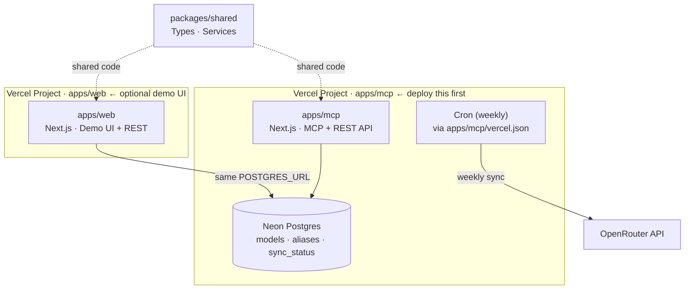

# OpenRouter MCP Registry

[](https://vercel.com/new/clone?repository-url=https://github.com/tj60647/openrouter-mcp-registry)

A production-ready monorepo that provides a **centralized MCP model registry** backed by OpenRouter, plus a **demo web application**. Designed for zero-config deployment on Vercel.

## Why?

AI coding assistants and agents that call LLM APIs directly suffer from:
- **Stale model names** — providers rename, deprecate, or remove models without notice
- **No abstraction** — every client hardcodes its own model IDs
- **No catalog** — no single source of truth for what models exist and what they cost

This registry solves all three problems:
- Fetches the live model catalog from OpenRouter weekly (and on-demand)
- Exposes a stable alias layer (`sonnet`, `fast-general`, `auto`, …)
- Serves an MCP-compatible endpoint that AI clients can query

---

## Architecture



### Monorepo layout

```
openrouter-mcp-registry/
├── apps/
│   ├── mcp/              Next.js app — MCP server + full REST API  ← primary
│   │   └── vercel.json   Vercel cron config for this project
│   └── web/              Next.js app — Demo UI + read REST API     ← optional
├── packages/
│   └── shared/           Shared TypeScript — types, services, providers
├── vercel.json           Cron config for apps/web if deployed from repo root
└── pnpm-workspace.yaml
```

---

## REST API

Both apps expose overlapping REST routes. **`apps/mcp`** is the canonical backend — prefer it for programmatic access. **`apps/web`** exposes a read-oriented subset for its demo UI.

### `apps/mcp` routes (full API)

| Method | Path | Description |
|--------|------|-------------|
| `GET` | `/api/models` | List cached models (`?limit`, `?offset`, `?provider`) |
| `GET` | `/api/models/:id` | Get model by canonical ID |
| `POST` | `/api/resolve` | Resolve alias/ID → canonical model |
| `GET` | `/api/health` | Health check + sync status summary |
| `POST` | `/api/admin/refresh` | Trigger manual sync (requires `ADMIN_SECRET`) |
| `GET` | `/api/admin/sync-status` | Full sync status (requires `ADMIN_SECRET`) |
| `GET` | `/api/cron/sync` | Weekly cron sync (protected by `CRON_SECRET`) |
| `POST` | `/api/mcp` | MCP Streamable HTTP endpoint |

### `apps/web` routes (demo UI)

| Method | Path | Description |
|--------|------|-------------|
| `GET` | `/api/models` | List cached models |
| `POST` | `/api/resolve` | Resolve alias/ID → canonical model |
| `GET` | `/api/health` | Health check |
| `POST` | `/api/admin/refresh` | Trigger manual sync (requires `ADMIN_SECRET`) |
| `GET` | `/api/cron/sync` | Weekly cron sync (protected by `CRON_SECRET`) |

## MCP Tools

Connect any MCP-compatible client to `POST /api/mcp`:

| Tool | Description | Parameters |
|------|-------------|------------|
| `list_models` | List all registry models | `limit`, `offset`, `provider` |
| `resolve_model` | Resolve alias or ID | `input: string` |
| `get_default_model` | Get the default model | — |
| `get_sync_status` | Current sync state | — |

---

## Default Aliases

| Alias | Resolves to |
|-------|-------------|
| `auto` | `openrouter/auto` |
| `sonnet` | `anthropic/claude-sonnet-4-5` |
| `haiku` | `anthropic/claude-haiku-4-5` |
| `opus` | `anthropic/claude-opus-4-5` |
| `fast-general` | `anthropic/claude-haiku-4-5` |
| `best-general` | `anthropic/claude-sonnet-4-5` |
| `gpt-4o` | `openai/gpt-4o` |
| `gemini` | `google/gemini-pro-1.5` |
| `mistral` | `mistralai/mistral-large` |

---

## Local Development

### Prerequisites

- Node.js ≥ 20
- pnpm ≥ 9 (`npm install -g pnpm`)
- A [Neon](https://neon.tech) or local Postgres database (Vercel provisions Neon automatically on deploy)
- An [OpenRouter](https://openrouter.ai) API key

### Setup

```bash
# 1. Clone and install
git clone https://github.com/tj60647/openrouter-mcp-registry
cd openrouter-mcp-registry
pnpm install

# 2. Configure environment
cp apps/mcp/.env.example apps/mcp/.env.local
cp apps/web/.env.example apps/web/.env.local
# Edit both .env.local files and fill in the required values
# (Both apps use the same POSTGRES_URL — point them at the same database)

# 3. Run database migrations
pnpm db:migrate

# 4. (Optional) Seed demo data
pnpm db:seed

# 5. Start development servers
pnpm dev
# web → http://localhost:3000
# mcp → http://localhost:3001
```

### Available Scripts

| Script | Description |
|--------|-------------|
| `pnpm dev` | Start all apps in parallel |
| `pnpm build` | Build all packages and apps |
| `pnpm test` | Run all tests |
| `pnpm typecheck` | TypeScript type check |
| `pnpm lint` | Lint all packages |
| `pnpm db:migrate` | Run database migrations |
| `pnpm db:seed` | Seed default aliases and demo models |

---

## Deployment (Vercel)

There are **two separate Vercel projects** — one for each app. Both share the same Neon Postgres database.

> **Minimum viable deployment:** you only need `apps/mcp`. Deploy `apps/web` only if you want the demo UI.

---

### Project 1 — `apps/mcp` (required)

This is the MCP server. It owns the database writes and the weekly cron sync.

#### 1. Create the Vercel project

1. Go to [vercel.com/new](https://vercel.com/new) and import your fork
2. Under **Root Directory**, enter `apps/mcp`
3. Vercel will auto-detect Next.js and configure the build

#### 2. Add a Neon database

In the **`mcp`** Vercel project → **Storage** → **Connect Database** → **Create New** → **Neon**

Vercel automatically injects `POSTGRES_URL` and `CRON_SECRET` into the project's environment.

#### 3. Set environment variables

In **Settings → Environment Variables**:

| Variable | Required | Description |
|----------|----------|-------------|
| `OPENROUTER_API_KEY` | ✅ | Your [OpenRouter](https://openrouter.ai) API key |
| `ADMIN_SECRET` | ✅ | Random secret for admin endpoints |
| `MCP_API_KEY` | ❌ | Token to protect the MCP endpoint (open if unset) |

#### 4. Run database migrations

After the first deploy, run migrations against your Neon database:

```bash
# Pull the injected env vars locally
npx vercel env pull apps/mcp/.env.local --project <your-mcp-project-name>

# Run migrations and seed default aliases
pnpm db:migrate
pnpm db:seed
```

> `pnpm db:migrate` and `pnpm db:seed` execute in the `apps/web` workspace (where the migration scripts live), but they use the `POSTGRES_URL` from your environment, so they work against whichever database the env var points to.

#### 5. Cron job

`apps/mcp/vercel.json` configures a weekly cron at `0 0 * * 0` (Sundays midnight UTC) that calls `/api/cron/sync`. Vercel automatically provides `CRON_SECRET` and sends it as a Bearer token — no additional setup needed.

---

### Project 2 — `apps/web` (optional demo UI)

This is the demo front-end. It reads from the same Neon database as `apps/mcp`.

#### 1. Create the Vercel project

1. Import the **same fork** to a second Vercel project
2. Under **Root Directory**, enter `apps/web`

#### 2. Connect the same database

You can either:
- **Share the existing integration:** in the Neon integration settings, attach it to the `web` project too (Vercel will inject `POSTGRES_URL` automatically), or
- **Copy the value manually:** paste the same `POSTGRES_URL` from the `mcp` project into the `web` project's environment variables.

#### 3. Set environment variables

| Variable | Required | Description |
|----------|----------|-------------|
| `OPENROUTER_API_KEY` | ✅ | Same OpenRouter API key |
| `ADMIN_SECRET` | ✅ | Same admin secret as the `mcp` project |
| `NEXT_PUBLIC_MCP_URL` | ✅ | Full URL of your deployed `mcp` app (e.g. `https://your-mcp-app.vercel.app`) |
| `NEXT_PUBLIC_APP_URL` | ❌ | Public URL of this web app |

`CRON_SECRET` is auto-injected by Vercel if you configure a cron for this project as well (see the repo-root `vercel.json`).

---

### `vercel.json` reference

| File | Used by | Purpose |
|------|---------|---------|
| `apps/mcp/vercel.json` | `apps/mcp` Vercel project | Weekly cron at `/api/cron/sync` |
| `vercel.json` (repo root) | `apps/web` Vercel project if root dir = repo root | Weekly cron at `/api/cron/sync` for the web app |

Both route files set `export const maxDuration = 60` inline, so no additional function config is needed in `vercel.json`.

---

## MCP Client Setup

The MCP endpoint is served by **`apps/mcp`** at `POST /api/mcp`.

### Claude Desktop

Add to your MCP config (`~/Library/Application Support/Claude/claude_desktop_config.json`):

```json
{
  "mcpServers": {
    "openrouter-registry": {
      "url": "https://your-mcp-app.vercel.app/api/mcp",
      "transport": "streamable-http"
    }
  }
}
```

### With API key protection

If `MCP_API_KEY` is set:

```json
{
  "mcpServers": {
    "openrouter-registry": {
      "url": "https://your-mcp-app.vercel.app/api/mcp",
      "transport": "streamable-http",
      "headers": {
        "Authorization": "Bearer YOUR_MCP_API_KEY"
      }
    }
  }
}
```

### Using in an agent

```typescript
// Resolve an alias to a canonical model ID
const result = await mcp.callTool('resolve_model', { input: 'sonnet' });
// → { resolved: 'anthropic/claude-sonnet-4-5', source: 'alias', found: true }

// List all available models
const models = await mcp.callTool('list_models', { limit: 50, provider: 'anthropic' });

// Get the default model
const def = await mcp.callTool('get_default_model', {});
```

---

## Database Schema

> Both `apps/mcp` and `apps/web` connect to the **same** Neon Postgres database. Migration scripts live in `apps/web/scripts/` and are run via `pnpm db:migrate` from the repo root. `apps/mcp` owns the write operations (upsert models, record sync status); `apps/web` reads from the same tables.

```sql
-- Cached model catalog from OpenRouter
CREATE TABLE models (
  id                  TEXT PRIMARY KEY,
  provider            TEXT NOT NULL,
  display_name        TEXT NOT NULL,
  context_length      INTEGER,
  input_price_per_1k  NUMERIC(18,10),
  output_price_per_1k NUMERIC(18,10),
  metadata            JSONB NOT NULL DEFAULT '{}',
  fetched_at          TIMESTAMPTZ NOT NULL DEFAULT NOW()
);

-- Stable alias → model ID mapping
CREATE TABLE aliases (
  alias      TEXT PRIMARY KEY,
  model_id   TEXT NOT NULL REFERENCES models(id) ON DELETE CASCADE,
  scope      TEXT NOT NULL DEFAULT 'system' CHECK (scope IN ('system', 'org')),
  created_at TIMESTAMPTZ NOT NULL DEFAULT NOW()
);

-- Singleton sync state row
CREATE TABLE sync_status (
  id                   INTEGER PRIMARY KEY DEFAULT 1 CHECK (id = 1),
  last_successful_sync TIMESTAMPTZ,
  last_attempted_sync  TIMESTAMPTZ,
  last_error           TEXT,
  record_count         INTEGER NOT NULL DEFAULT 0
);
```

---

## Security

- **Admin endpoints** require `Authorization: Bearer <ADMIN_SECRET>` header
- **MCP endpoint** is open by default; set `MCP_API_KEY` to require Bearer auth
- **Cron endpoint** is protected by `CRON_SECRET` (injected by Vercel automatically)
- All user inputs validated with [Zod](https://zod.dev)
- Model IDs treated as opaque strings — LLM reasoning never determines validity

---

## Testing

```bash
# Run all tests
pnpm test

# Run tests for a specific package
pnpm --filter @openrouter-mcp/shared test
pnpm --filter @openrouter-mcp/mcp test
```

Tests cover:
- Model ID canonicalization
- Alias resolution (system and custom)
- Model registry resolution logic
- Sync service (success, lock contention, provider errors)
- Auth guards (admin token, MCP token)

---

## Environment Variables Reference

### `apps/mcp`

| Variable | Required | Description |
|----------|----------|-------------|
| `OPENROUTER_API_KEY` | ✅ | OpenRouter API key for model fetching |
| `POSTGRES_URL` | ✅ | Neon/Postgres connection string (auto-injected by Vercel) |
| `ADMIN_SECRET` | ✅ | Token for admin endpoints |
| `MCP_API_KEY` | ❌ | Token for MCP endpoint (open if unset) |
| `CRON_SECRET` | ❌ | Vercel cron auth (auto-injected by Vercel) |

### `apps/web`

| Variable | Required | Description |
|----------|----------|-------------|
| `OPENROUTER_API_KEY` | ✅ | OpenRouter API key for model fetching |
| `POSTGRES_URL` | ✅ | Same Neon/Postgres connection string as the `mcp` project |
| `ADMIN_SECRET` | ✅ | Token for admin endpoints |
| `NEXT_PUBLIC_MCP_URL` | ✅ | Full URL of your deployed `mcp` app |
| `NEXT_PUBLIC_APP_URL` | ❌ | Public URL of this web app |
| `CRON_SECRET` | ❌ | Vercel cron auth (auto-injected by Vercel) |

---

## Contributing

1. Fork the repository
2. Create a feature branch
3. Run `pnpm typecheck && pnpm test` before submitting
4. Open a pull request

---

## License

MIT
